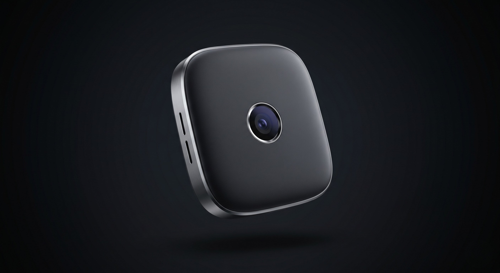

<div align="center">



# Finn the Pin

### Independence is an invisible luxury.

**A discreet, magnetic, wearable AI companion for blind and visually impaired people.**

[**finnthepin.com**](https://finnthepin.com) · Real-time audio guidance · Socially invisible by design

</div>

---

## About

**Finn the Pin** is a magnetic wearable that attaches to clothing and pairs with wireless earphones. A built-in camera and Generative AI read the surrounding world and speak it back, privately and in real time, helping users navigate streets, recognise text and signals, and move through daily life with autonomy and dignity.

- **Obstacle detection**: real-time hazard alerts
- **Text & label reading**: labels, prices, expiry dates, signage
- **Traffic & signals**: pedestrian lights, crossings, bus numbers
- **Navigation**: turn-by-turn, indoors and outdoors
- **Voice & tap**: no screen, no buttons, no attention
- **Private audio**: continuous, contextual cues for you only

## The site

This repository hosts the official landing page — a single-page, dark, Apple-style site built with plain **HTML, CSS and vanilla JavaScript** (no frameworks, no build step). Deployed via **GitHub Pages** on the custom domain [finnthepin.com](https://finnthepin.com).

```
.
├── index.html      # page markup
├── styles.css      # dark theme, layout, animations
├── main.js         # scroll reveal, nav, mobile menu
└── assets/         # optimized product & scenario imagery
```

### Run locally

```bash
python3 -m http.server 8080
# then open http://localhost:8080
```

---

<div align="center">

A project by **Team 7 — Prototyping Factory**

</div>
